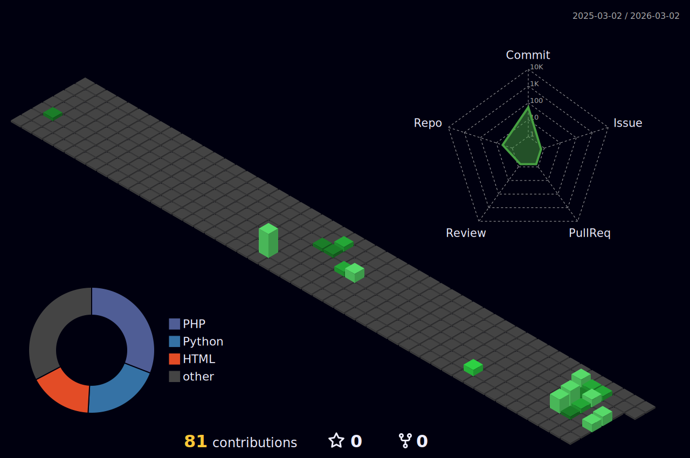

# 👋 Olá, eu sou o Michael Dumont

💻 Desenvolvedor Full Stack  
🚀 Apaixonado por tecnologia, automação e design de sistemas  
📚 Sempre aprendendo algo novo  

---

## 🔧 Tecnologias e Ferramentas

---

## 📈 Atividade no GitHub

---

## 🌎 Onde me encontrar

